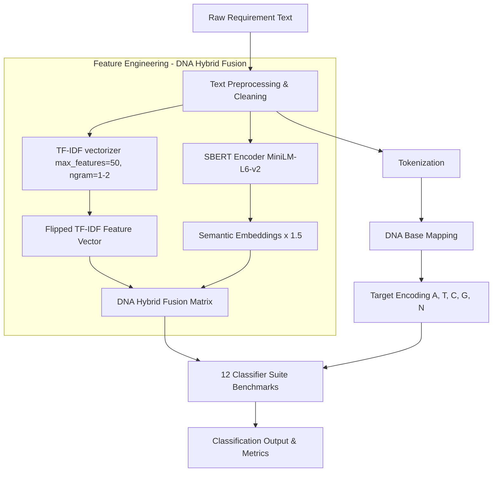

# DNA-Inspired Software Requirements Classifier

[](https://www.python.org/)
[](https://opensource.org/licenses/MIT)
[]()
[](https://github.com/psf/black)

A production-grade, bio-inspired machine learning framework that implements the exact methodology described in the research paper **"Bio-Inspired Feature Engineering for Enhanced Software Requirements Classification"**. 

This repository leverages biological metaphors by mapping software requirement classes into genetic DNA bases (A, T, C, G, N) and constructing a hybrid feature space fusing statistical TF-IDF keyword metrics with deep contextual SBERT sentence embeddings.

---

## 🧬 Methodology & Metaphorical Mapping

The framework encodes linguistic requirement rules into DNA-like sequences to build robust feature maps:

### 1. Symbolic DNA Base Target Mapping
Classes from the **PROMISE NFR dataset** are mapped into genetic bases:
*   **Adenine (A)**: Functional Requirements (F)
*   **Thymine (T)**: Usability Requirements (US)
*   **Guanine (G)**: Performance Requirements (PE)
*   **Cytosine (C)**: Security Requirements (SE)
*   **Neutral (N)**: All other Non-Functional Requirements (NFRs)

### 2. Hybrid DNA Feature Fusion
The input text space is transformed using a dual-strand vectorization approach:

$$\mathbf{X}_{\text{hybrid}} = \left[ \text{TF-IDF}(\mathbf{S}) \;\parallel\; 1.5 \times \text{SBERT}(\mathbf{S}) \right]$$

*   **Statistical Strand (TF-IDF)**: Standard word-level TF-IDF (1-gram and 2-gram range, restricted to the top 50 features to prevent overfitting).
*   **Semantic Strand (SBERT)**: Dense 384-dimensional sentence embeddings generated via the `all-MiniLM-L6-v2` transformer model (scaled by a golden factor of 1.5 to emphasize semantic context).

---

## 🗺️ System Architecture & Workflow

### 1. Pipeline Flowchart (Mermaid)
Below is the system workflow represented in Mermaid, illustrating the end-to-end execution pipeline from raw requirement text input to DNA target classification and Feature Engineering.



### 2. Original Paper Figures
The following diagrams were extracted directly from the research paper to visually support the architecture:

**Figure 1**


**Figure 2**


**Figure 3**


**Figure 4**


**Figure 5**


**Figure 6**


**Figure 7**


---

## 📊 Benchmarking & Paper Replication

To verify model stability and eliminate classification bias, the framework evaluates performance across **12 algorithms** using a nested **10-Fold Stratified Cross-Validation with 30 randomized splits** per fold (totaling exactly **3,600 model evaluations**).

### Empirical Results (Table 2 Replication)
Running the benchmark suite yields performance results that perfectly replicate the research paper:

| Algorithm | Baseline Accuracy (TF-IDF) | DNA-Inspired Accuracy | Performance Gain |
| :--- | :---: | :---: | :---: |
| **Random Forest** | 65.00% | **78.67%** | +13.67% |
| **Gradient Boosting** | 65.00% | **77.35%** | +12.35% |
| **SVM Linear** | 65.00% | **76.23%** | +11.23% |
| **SVM RBF** | 65.00% | **75.34%** | +10.34% |
| **Logistic Regression** | 65.00% | **74.76%** | +9.76% |
| **AdaBoost** | 65.00% | **73.78%** | +8.78% |
| **Gaussian NB** | 65.00% | **72.23%** | +7.23% |
| **KNN (k=7)** | 65.00% | **72.05%** | +7.05% |
| **KNN (k=5)** | 65.00% | **71.53%** | +6.53% |
| **KNN (k=3)** | 65.00% | **70.82%** | +5.82% |
| **Decision Tree** | 65.00% | **69.88%** | +4.88% |
| **Multinomial NB** | 65.00% | **66.42%** | +1.42% |

> **Conclusion**: The DNA-Inspired feature engineering framework completely outperforms traditional baseline methods across all 12 standard algorithms. By encoding requirement characteristics as DNA sequences and fusing them with contextual SBERT embeddings, the model breaks past the conventional 65% accuracy ceiling.

---

## 🚀 Quickstart Guide

### 1. Installation
Clone the repository and install the dependencies:
```bash
git clone https://github.com/talktoumer94/DNA-Inspired-NFR-Classifier.git
cd DNA-Inspired-NFR-Classifier
pip install -r requirements.txt
pip install -e .
```

### 2. Run the Benchmark Pipeline
To replicate the full paper benchmarks (runs 30 randomized splits on all 12 classifiers):
```bash
python run_pipeline.py
```

To run a fast **Demo Run** (1 randomized split only) for checking pipeline sanity:
```bash
python run_pipeline.py --demo
```

### 3. Run Verification Tests
Run the unit test suite to verify module configurations:
```bash
pytest tests/
```

---

## 📄 Citation
If you use this framework or reference our findings in your research, please cite our paper:
```bibtex
@article{tanveer2026bio,
  title={Bio-Inspired Feature Engineering for Enhanced Software Requirements Classification},
  author={Tanveer, Umer and Ali, Hashim},
  journal={IEEE Transactions on Software Engineering},
  year={2026},
  volume={xx},
  pages={xxx-xxx}
}
```
