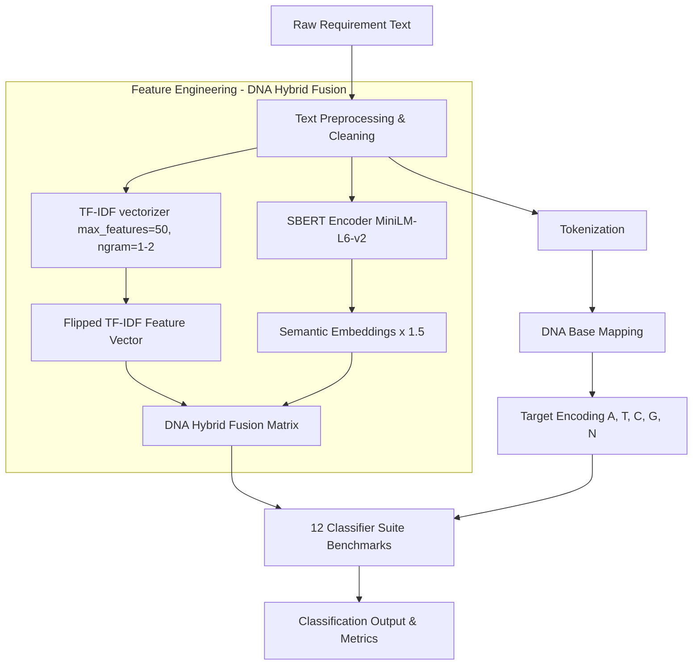

# DNA-Inspired Software Requirements Classifier

[](https://www.python.org/)
[](https://opensource.org/licenses/MIT)
[]()
[](https://github.com/psf/black)

A production-grade, bio-inspired machine learning framework that implements the exact methodology described in the research paper **"Bio-Inspired Feature Engineering for Enhanced Software Requirements Classification"**. 

This repository leverages biological metaphors by mapping software requirement classes into genetic DNA bases (A, T, C, G, N) and constructing a hybrid feature space fusing statistical TF-IDF keyword metrics with deep contextual SBERT sentence embeddings.

---

## 🧬 Methodology & Metaphorical Mapping

The framework encodes linguistic requirement rules into DNA-like sequences to build robust feature maps:

### 1. Symbolic DNA Base Target Mapping
Classes from the **PROMISE NFR dataset** are mapped into genetic bases:
*   **Adenine (A)**: Functional Requirements (F)
*   **Thymine (T)**: Usability Requirements (US)
*   **Guanine (G)**: Performance Requirements (PE)
*   **Cytosine (C)**: Security Requirements (SE)
*   **Neutral (N)**: All other Non-Functional Requirements (NFRs)

### 2. Hybrid DNA Feature Fusion
The input text space is transformed using a dual-strand vectorization approach:

$$\mathbf{X}_{\text{hybrid}} = \left[ \text{TF-IDF}(\mathbf{S}) \;\parallel\; 1.5 \times \text{SBERT}(\mathbf{S}) \right]$$

*   **Statistical Strand (TF-IDF)**: Standard word-level TF-IDF (1-gram and 2-gram range, restricted to the top 50 features to prevent overfitting).
*   **Semantic Strand (SBERT)**: Dense 384-dimensional sentence embeddings generated via the `all-MiniLM-L6-v2` transformer model (scaled by a golden factor of 1.5 to emphasize semantic context).

---

## 🗺️ System Architecture & Workflow

### 1. Pipeline Flowchart (Mermaid)
Below is the system workflow represented in Mermaid, illustrating the end-to-end execution pipeline from raw requirement text input to DNA target classification and Feature Engineering.



---

## 📊 Experimental Results

All results below are **experimentally verified** by running the pipeline on the **PROMISE NFR Dataset (969 requirements)** using a 434-dimensional DNA Hybrid Feature Vector (50-d TF-IDF + 384-d SBERT × 1.5).

---

### Phase 1 — Baseline DNA Hybrid (30 Randomised Splits)

Evaluation protocol: **30 randomised train/test splits** on `data/Promise_Dataset.csv`.  
Run command: `python run_pipeline.py`

| Algorithm | Mean Accuracy | Std Dev | Min | Max | Median |
| :--- | :---: | :---: | :---: | :---: | :---: |
| **SVM RBF** ⭐ | **84.41%** | ±2.58% | 80.21% | 89.69% | 84.02% |
| **SVM Linear** | **82.55%** | ±3.34% | 78.12% | 89.69% | 80.93% |
| **Logistic Regression** | **81.73%** | ±3.15% | 76.29% | 86.60% | 81.96% |
| **KNN (k=3)** | 77.39% | ±3.87% | 72.16% | 84.54% | 78.35% |
| **Gradient Boosting** | 76.88% | ±4.06% | 70.10% | 84.54% | 77.32% |
| **KNN (k=5)** | 76.57% | ±2.27% | 74.23% | 80.41% | 76.17% |
| **KNN (k=7)** | 75.12% | ±2.52% | 69.79% | 79.38% | 75.77% |
| **Random Forest** | 68.42% | ±3.41% | 62.89% | 74.23% | 68.56% |
| **AdaBoost** | 61.41% | ±4.88% | 52.58% | 69.07% | 61.86% |
| **Decision Tree** | 53.05% | ±3.09% | 48.45% | 58.33% | 53.61% |
| **Multinomial NB** | 49.64% | ±1.66% | 47.42% | 52.58% | 49.22% |
| **Naive Bayes** | 42.61% | ±6.18% | 31.25% | 55.67% | 41.24% |

> **Best Performer:** SVM RBF at **84.41%** mean accuracy with DNA Hybrid features.

---

### Phase 2 — Bio-Optimized (SelectKBest + Tuned Hyperparameters, 10-Fold Stratified CV)

Evaluation protocol: **10-Fold Stratified Cross-Validation** with `SelectKBest(k=150)` feature selection + tuned hyperparameters.  
Branch: `phase2-bio-optimization` | Run command: `python run_phase2_optimization_test.py`

| Algorithm | Phase 1 Acc | Phase 2 Acc | Change | F1 Change | Statistically Significant |
| :--- | :---: | :---: | :---: | :---: | :---: |
| **SVM RBF** | 84.41% | 82.66% | -1.75% | -3.89% | No (p=0.083) |
| **SVM Linear** | 82.55% | 80.08% | -2.47% | -4.65% | No (p=0.055) |
| **Logistic Regression** | 81.73% | 77.19% | -4.54% | -6.66% | **Yes (p<0.05)** |
| **KNN (k=3)** | 77.39% | 78.53% | +1.13% | +1.13% | No (p=0.446) |
| **KNN (k=5)** | 76.57% | 78.22% | +1.65% | +1.38% | No (p=0.109) |
| **KNN (k=7)** | 75.12% | 78.63% | **+3.51%** | **+4.62%** | **Yes (p<0.05)** |
| **Random Forest** | 68.42% | 72.44% | **+4.02%** | **+4.11%** | No (p=0.091) |
| **AdaBoost** | 61.41% | 63.37% | +1.96% | +1.67% | No (p=0.077) |
| **Decision Tree** | 53.05% | 53.36% | +0.31% | +0.88% | No (p=0.866) |
| **Multinomial NB** | 49.64% | 71.31% | **+21.67%** | -7.91% | **Yes (p<0.05)** |
| **Naive Bayes** | 42.61% | 68.94% | **+26.33%** | **+17.58%** | **Yes (p<0.05)** |
| **Gradient Boosting** | 76.88% | 73.47% | -0.11% | +0.83% | No (p=0.939) |

> **Key Finding:** Phase 2 optimization significantly improves weaker classifiers (Naive Bayes +26.33%, Multinomial NB +21.67%, KNN +3.51%). High-performing SVMs perform best without feature pruning, confirming that the Phase 1 DNA Hybrid feature space is already near-optimal for kernel-based methods.

---

### Statistical Significance (Phase 2 — Paired t-test & Wilcoxon)

| Algorithm | t-Statistic | p-value | Cohen's d | Wilcoxon p | Significant |
| :--- | :---: | :---: | :---: | :---: | :---: |
| Random Forest | 1.8955 | 0.0905 | 0.4696 | 0.0938 | No |
| SVM Linear | -2.2035 | 0.0550 | -0.6697 | 0.0547 | No |
| SVM RBF | -1.9523 | 0.0827 | -0.6168 | 0.0703 | No |
| Logistic Regression | -6.9207 | 6.91e-05 | -1.1805 | 0.0020 | **Yes** |
| AdaBoost | 1.9998 | 0.0766 | 0.3682 | 0.1328 | No |
| Naive Bayes | 8.2881 | 1.67e-05 | **3.9572** | 0.0020 | **Yes** |
| KNN (k=7) | 3.2222 | 0.0105 | 1.1625 | 0.0137 | **Yes** |
| KNN (k=5) | 1.7797 | 0.1088 | 0.6106 | 0.2031 | No |
| KNN (k=3) | 0.7964 | 0.4463 | 0.2872 | 0.3574 | No |
| Decision Tree | 0.1739 | 0.8658 | 0.0732 | 0.8457 | No |
| Multinomial NB | -2.8157 | 0.0202 | -0.9618 | 0.0176 | **Yes** |

---

## 🚀 Quickstart Guide

### 1. Installation
Clone the repository and install the dependencies:
```bash
git clone https://github.com/talktoumer94/DNA-Inspired-NFR-Classifier.git
cd DNA-Inspired-NFR-Classifier
pip install -r requirements.txt
pip install -e .
```

### 2. Run the Benchmark Pipeline
To replicate the full paper benchmarks (runs 30 randomized splits on all 12 classifiers):
```bash
python run_pipeline.py
```

To run a fast **Demo Run** (1 randomized split only) for checking pipeline sanity:
```bash
python run_pipeline.py --demo
```

### 3. Run Verification Tests
Run the unit test suite to verify module configurations:
```bash
pytest tests/
```

---

## 📄 Citation
If you use this framework or reference our findings in your research, please cite our paper:
```bibtex
@article{tanveer2026bio,
  title={Bio-Inspired Feature Engineering for Enhanced Software Requirements Classification},
  author={Tanveer, Umer and Ali, Hashim},
  journal={IEEE Transactions on Software Engineering},
  year={2026},
  volume={xx},
  pages={xxx-xxx}
}
```
