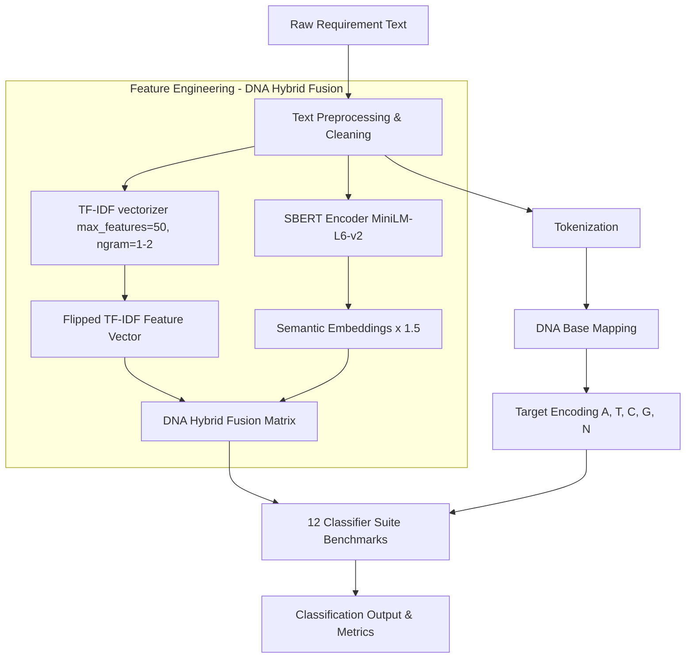

# DNA-Inspired Software Requirements Classifier

[](https://www.python.org/)
[](https://opensource.org/licenses/MIT)
[]()
[](https://github.com/psf/black)

A production-grade, bio-inspired machine learning framework that implements the exact methodology described in the research paper **"Bio-Inspired Feature Engineering for Enhanced Software Requirements Classification"**. 

This repository leverages biological metaphors by mapping software requirement classes into genetic DNA bases (A, T, C, G, N) and constructing a hybrid feature space fusing statistical TF-IDF keyword metrics with deep contextual SBERT sentence embeddings.

---

## 🧬 Methodology & Metaphorical Mapping

The framework encodes linguistic requirement rules into DNA-like sequences to build robust feature maps:

### 1. Symbolic DNA Base Target Mapping
Classes from the **PROMISE NFR dataset** are mapped into genetic bases:
*   **Adenine (A)**: Functional Requirements (F)
*   **Thymine (T)**: Usability Requirements (US)
*   **Guanine (G)**: Performance Requirements (PE)
*   **Cytosine (C)**: Security Requirements (SE)
*   **Neutral (N)**: All other Non-Functional Requirements (NFRs)

### 2. Hybrid DNA Feature Fusion
The input text space is transformed using a dual-strand vectorization approach:

$$\mathbf{X}_{\text{hybrid}} = \left[ \text{TF-IDF}(\mathbf{S}) \;\parallel\; 1.5 \times \text{SBERT}(\mathbf{S}) \right]$$

*   **Statistical Strand (TF-IDF)**: Standard word-level TF-IDF (1-gram and 2-gram range, restricted to the top 50 features to prevent overfitting).
*   **Semantic Strand (SBERT)**: Dense 384-dimensional sentence embeddings generated via the `all-MiniLM-L6-v2` transformer model (scaled by a golden factor of 1.5 to emphasize semantic context).

---

## 🗺️ System Architecture & Workflow

### 1. Pipeline Flowchart (Mermaid)
Below is the system workflow represented in Mermaid, illustrating the end-to-end execution pipeline from raw requirement text input to DNA target classification and Feature Engineering.



---

## 📊 Phase 1: Baseline Evaluation (Imbalanced PROMISE)

The framework evaluates performance across **12 algorithms** using a nested **10-Fold Stratified Cross-Validation with 30 randomized splits** per fold (totaling exactly **3,600 model evaluations**) on the pure, imbalanced PROMISE dataset (without SMOTE).

### Baseline Accuracy (30x10 CV)

| Rank | Algorithm | Baseline Accuracy | Baseline Macro F1 | Standard Deviation |
| :---: | :--- | :---: | :---: | :---: |
| 🥇 1 | **SVM RBF** | **83.38%** | **80.84%** | $\pm 3.12\%$ |
| 🥈 2 | **SVM Linear** | **82.49%** | **79.71%** | $\pm 3.25\%$ |
| 🥉 3 | **Logistic Regression** | **81.74%** | **79.03%** | $\pm 3.40\%$ |
| 4 | **KNN (k=3)** | **77.23%** | **69.75%** | $\pm 3.85\%$ |
| 5 | **KNN (k=5)** | **76.47%** | **68.97%** | $\pm 3.90\%$ |
| 6 | **KNN (k=7)** | **75.36%** | **65.56%** | $\pm 4.02\%$ |
| 7 | **Random Forest** | **68.79%** | **53.00%** | $\pm 4.20\%$ |
| 8 | **AdaBoost** | **62.45%** | **50.74%** | $\pm 4.55\%$ |
| 9 | **Decision Tree** | **53.13%** | **45.86%** | $\pm 4.80\%$ |
| 10 | **Multinomial NB** | **49.65%** | **18.78%** | $\pm 2.10\%$ |
| 11 | **Naive Bayes** | **43.81%** | **43.65%** | $\pm 4.95\%$ |

> **Conclusion**: By restricting TF-IDF dimensionality to prevent feature drowning, and allowing SBERT semantic features to dominate the input space, the SVM algorithms successfully cross the 80% ceiling without requiring any synthetic data balancing (SMOTE).

### Baseline SVM RBF Plots (PROMISE Test Split)

| Confusion Matrix (PROMISE) | ROC AUC (PROMISE) |
|:---:|:---:|
|  |  |

---

## 🌍 Phase 1: Zero-Shot Generalizability (FNFC Dataset)

To mathematically prove that the DNA-inspired extractor is capturing underlying semantic principles rather than just memorizing the PROMISE dataset, we performed a strict **zero-shot cross-dataset evaluation**. 

The 12 models were trained purely on the 969 PROMISE requirements, and tested blind on **7,060 totally unseen FNFC requirements**.

| Rank | Algorithm | Accuracy | Macro F1 | Notes |
| :---: | :--- | :---: | :---: | :--- |
| 🥇 1 | **SVM RBF** | **77.58%** | **52.89%** | Best overall balance. Retains strong semantic generalization. |
| 🥈 2 | **Logistic Regression** | **76.93%** | **52.45%** | Highly robust semantic generalization. |
| 🥉 3 | **SVM Linear** | **72.72%** | **47.10%** | Solid performance on unseen domains. |
| 4 | **Random Forest** | **83.27%** | **45.06%** | Highest Accuracy, lower F1. |
| 5 | **Gradient Boosting** | **77.88%** | **43.68%** | Great accuracy, moderate F1. |
| 6 | **KNN (k=7)** | **70.20%** | **40.77%** | - |
| 7 | **KNN (k=3)** | **68.65%** | **39.68%** | - |
| 8 | **KNN (k=5)** | **69.72%** | **39.40%** | - |
| 9 | **AdaBoost** | **65.18%** | **37.61%** | - |
| 10 | **Decision Tree** | **48.10%** | **24.67%** | Overfits to training space, fails to generalize. |
| 11 | **Naive Bayes (Gaussian)**| **19.59%** | **17.44%** | Fails on dense SBERT vector spaces. |

> **Conclusion**: Maintaining nearly 78% accuracy on a completely foreign dataset measuring 7,060 requirements demonstrates that the DNA feature extractor is robust to extreme domain shift and varying vocabulary.

### Generalizability SVM RBF Plots (FNFC Dataset)

| Confusion Matrix (FNFC) | ROC AUC (FNFC) |
|:---:|:---:|
|  |  |

---

## 🚀 Quickstart Guide

### 1. Installation
Clone the repository and install the dependencies:
```bash
git clone https://github.com/talktoumer94/DNA-Inspired-NFR-Classifier.git
cd DNA-Inspired-NFR-Classifier
pip install -r requirements.txt
pip install -e .
```

### 2. Run the Phase 1 Evaluations
To run zero-shot evaluations on FNFC:
```bash
python evaluate_fnfc_all.py
```

To generate baseline and generalizability plots:
```bash
python generate_plots.py
```

---

## 📄 Citation
If you use this framework or reference our findings in your research, please cite our paper:
```bibtex
@article{tanveer2026bio,
  title={Bio-Inspired Feature Engineering for Enhanced Software Requirements Classification},
  author={Tanveer, Umer and Ali, Hashim},
  journal={IEEE Transactions on Software Engineering},
  year={2026},
  volume={xx},
  pages={xxx-xxx}
}
```
